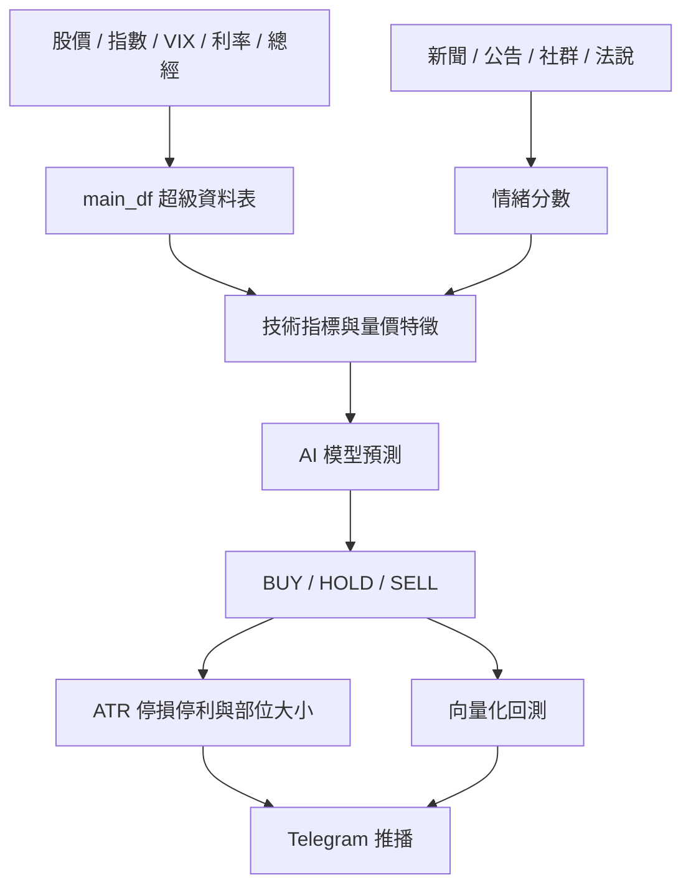

# 台股 AI 量化分析系統

這個專案把「數據蒐集 → 特徵工程 → 情緒因子 → AI 預測 → 風險控管 → 回測 → Telegram 推播」做成一條可執行的 Python 管線。預設可以用離線 demo 資料完整跑通，之後再接真實行情、新聞、券商或資料商 API。

> 這是研究與工程框架，不是投資建議。實盤前請務必做資料校驗、交易成本、滑價、流動性、稅費與風控壓力測試。

## 系統架構



## 快速開始

```bash
python3 -m venv .venv
source .venv/bin/activate
pip install -e ".[dev]"
PYTHONPATH=src python -m tw_ai_quant.cli --config configs/example.yml demo
```

產出會放在 `artifacts/`：

- `main_df.csv`：整合後的核心資料表
- `features.csv`：技術指標、量價、總經、情緒特徵
- `signal_history.csv`：每日模型訊號
- `latest_risk_plan.csv`：最新 BUY/HOLD/SELL 與停損、停利、部位
- `equity_curve.csv`：回測淨值曲線
- `metrics.csv`：模型與策略績效
- `model_comparison.csv`：多模型測試集比較與最佳模型
- `feature_importance.csv`：最佳模型的特徵重要度
- `model.joblib`：訓練後模型

## 接真實資料

編輯 `configs/example.yml` 後執行：

```bash
PYTHONPATH=src python -m tw_ai_quant.cli --config configs/example.yml run
```

預設支援：

- `yfinance`：台股個股如 `2330.TW`、上櫃如 `6488.TWO`、大盤 `^TWII`、VIX `^VIX`、美債殖利率 `^TNX`
- `prices_csv`：自備 OHLCV CSV，欄位需含 `date,ticker,open,high,low,close,volume`
- `macro_csv`：自備總經 CSV，欄位需含 `date`，其他如 `cpi,gdp,pmi,rate`
- `news_csv`：自備新聞 CSV，欄位建議 `date,ticker,title,summary,content`

股票中文名稱由內建對照表產生；若要覆蓋名稱，可在設定檔新增 `ticker_names` 對照。

## 網頁儀表板

最簡單的方式：在 Finder 裡直接點兩下 `開啟量化儀表板.command`。

如果要更新真實行情並開啟真實資料儀表板，點兩下 `更新真實資料儀表板.command`。

如果要使用可操作的 FastAPI 本機網站，點兩下 `啟動量化網站.command`，或打開 `http://127.0.0.1:8010`。

產生靜態網頁：

```bash
PYTHONPATH=src .venv/bin/python -m tw_ai_quant.cli --output-dir artifacts --report-dir reports report
open reports/dashboard.html
```

或啟動本機網頁服務：

```bash
PYTHONPATH=src .venv/bin/python -m tw_ai_quant.cli --output-dir artifacts --report-dir reports serve
```

然後打開 `http://127.0.0.1:8000/dashboard.html`。

真實資料模式會輸出到 `artifacts_real/` 與 `reports_real/`，其中 `data_coverage.csv` 會列出每檔股票是否成功抓到資料。

FastAPI 網站提供：

- `/`：動態網頁操作介面
- `/stock/{ticker}`：個股 K 線、技術指標、AI 風控與延伸分析第二頁
- `/backtest`：策略回測中心
- `/notify`：Telegram 推播中心
- `/schedule`：排程中心，管理盤中更新、收盤分析與晚間推播
- `/api/signals`：最新 AI 訊號
- `/api/metrics`：模型與回測績效
- `/api/backtest`：資金曲線、回撤、月份報酬與訊號分布
- `/api/notification`：每日推播訊息預覽與 Telegram 設定狀態
- `/api/schedule`：排程設定、最近執行紀錄與輸出狀態
- `/api/jobs/{job_name}`：手動執行 `intraday`、`after_close`、`evening_notify`
- `/api/coverage`：資料抓取狀態
- `/api/news`：新聞與情緒分數
- `/api/sentiment`：每日股票情緒因子
- `/api/model-comparison`：AI 模型比較結果
- `/api/feature-importance`：最佳模型的特徵重要度
- `/api/technical/{ticker}`：個股技術指標、趨勢判讀、風控與延伸分析框架
- `/api/chart/{ticker}`：個股紅綠 K 線、MA20/MA60/MA120、成交量與 MACD 圖表資料
- `/api/run`：手動更新 demo 或真實資料分析
- `/docs`：自動產生的 API 文件

個股頁的基本面、營收、法人、融資券與持股分布目前先以「待接資料」框架呈現；等串接公開資訊觀測站、TWSE/TPEX 或集保資料後即可填入真實數值。

## 新聞情緒因子

## 燈號與推薦評分

- `AI 原始燈號`：只看模型輸出的 `prob_up`，目前 `>= 58%` 為買進、`<= 42%` 為賣出，其餘觀望。
- `綜合燈號`：看 `推薦評分 + AI 機率 + 弱勢/過熱條件`；評分 `>= 75`、AI 上漲機率 `> 50%`、未跌破 MA20、RSI 未過熱才亮綠燈。
- `推薦評分`：AI 機率、趨勢、技術面、量能、風報比五構面加權，弱勢與 RSI 過熱會扣分。

系統會從設定檔的 RSS 來源抓取新聞，使用中文詞典法先產生基礎版 `sentiment_score`，並依新聞內文出現的股票代號或中文股名對應到股票。

預設來源：

- Yahoo 股市台股動態：`https://tw.stock.yahoo.com/rss?category=tw-market`
- Yahoo 股市最新新聞：`https://tw.stock.yahoo.com/rss?category=news`
- 中央社產經證券：`https://feeds.feedburner.com/rsscna/finance`

產出檔案：

- `news_items.csv`：新聞、來源、對應股票、情緒分數
- `daily_sentiment.csv`：每日每檔股票情緒因子

## 可替換模組

- 模型：預設會比較 `random_forest`、`extra_trees`、`gradient_boosting`，依 `roc_auc` 選最佳模型；若安裝 `pip install -e ".[boosting]"`，可把 `lightgbm` 或 `xgboost` 加入 `model.candidates`
- 情緒：目前內建中文詞典法，之後可替換成 OpenAI / 本地 LLM 分析新聞與法說逐字稿
- 回測：目前是等權 BUY 訊號向量化回測，後續可擴充成再平衡、停損出場、資金水位與多策略組合
- 推播：設定 `.env` 的 `TELEGRAM_BOT_TOKEN`、`TELEGRAM_CHAT_ID`，並把 `telegram.enabled` 改成 `true`

## 排程中心

系統目前把自動化拆成三個任務：

- 盤中 `intraday`：只更新行情快照、當沖分數與訊號排序，輸出 `daytrade_latest.csv/json`
- 收盤後 `after_close`：跑完整資料更新、特徵工程、AI 模型、回測與報告
- 晚間 `evening_notify`：讀取最新訊號並送出 Telegram 每日摘要

可先手動測試單一任務：

```bash
PYTHONPATH=src .venv/bin/python -m tw_ai_quant.cli --config configs/example.yml job intraday --mode real
PYTHONPATH=src .venv/bin/python -m tw_ai_quant.cli --config configs/example.yml job after_close --mode real
PYTHONPATH=src .venv/bin/python -m tw_ai_quant.cli --config configs/example.yml job evening_notify --mode real
```

確認任務正常後，再啟動長駐排程：

```bash
PYTHONPATH=src .venv/bin/python -m tw_ai_quant.cli --config configs/example.yml schedule --mode real
```

也可以直接點兩下 `啟動自動排程.command`，它會打開排程中心並開始長駐排程。請保持該終端機視窗開著；視窗關閉後，排程就會停止。排程狀態會寫入 `artifacts_real/scheduler_heartbeat.json`，執行紀錄會追加到 `artifacts_real/scheduler.log`。

排程時間可在 `configs/example.yml` 的 `schedule` 區塊調整。

## 我會怎麼把它做強

1. 先固定資料規格，確保 `main_df` 每天能穩定更新與補值。
2. 加入資料品質檢查，避免除權息、缺值、異常量價污染模型。
3. 把情緒因子從詞典升級成 LLM 批次評分，並保存原文、分數、理由與可信度。
4. 用 walk-forward validation 取代單次切分，避免過度擬合。
5. 把風控獨立成策略層，支援 ATR 停損、最大部位、最大回撤降槓桿。
6. 每天排程跑資料更新、模型推論、回測監控與 Telegram 推播。
7. 最後再加入 `trade_log` 交易紀錄表：等實際操作或模擬盤累積資料後，統計每筆進出場、停損/停利、勝率、平均賺賠比、最大連虧與策略優化方向。

## 後續框架順序

接下來先把主架構完成，交易紀錄表先放到最後做，避免在沒有實際交易資料時過早做出失真的統計。

1. 完成風控層：確認入場價、停損價、停利價、部位大小規則。
2. 完成回測層：讓停損、停利與部位大小正式進入策略回測。
3. 完成推播層：Telegram 每日自動推播訊號與風控價格。
4. 完成排程層：每天自動抓資料、更新模型、產生訊號與報告。
5. 最後完成交易紀錄層：建立 `trade_log`，用實際/模擬交易結果做績效統計與系統優化。
